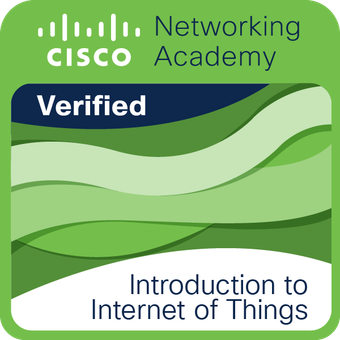

# Pascal Bienenstein 💻 My Tech Stack

## 🌍 About Me
I am a certified **Fachinformatiker für Anwendungsentwicklung** (Application Development Specialist) based in **Leipzig** and **Berlin**.

[🌐 Visit my website](https://pbienenstein.de/)

## 🌐 Languages
- **JavaScript**
- **TypeScript**
- **Java**
- **SQL**
- **HTML**
- **CSS**

## 💡 Skills
### Development of Progressive Web Applications (PWA) using:
- **React** ⚛️
- **Bootstrap** 🎨
- **MariaDB** 🛢️
- **Supabase** 🚀

## 🎯 Experience
- **Kanban**
- **Scrum**
- **Object-Oriented Programming (OOP)**

## 🚀 Current Projects  
- **Implementation of a management system for current projects on my homepage after login**  
- **Time tracking for current projects on my homepage after login**  
- **Learning Python and preparing for certification according to PCEP and PCAP – see https://github.com/labpa/PythonLernen**  

## 🏅 Certificates  
### Cisco - Introduction to Cybersecurity  

This badge was issued to Pascal Bienenstein on September 15, 2023.

### Cisco - Introduction to IoT

This badge was issued to Pascal Bienenstein on January 30, 2025

### Cisco - Python Essentials 1

This badge was issued to Pascal Bienenstein on January 30, 2025